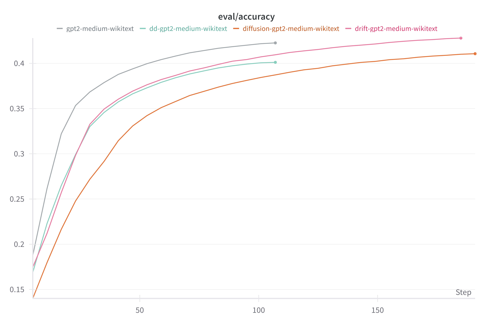
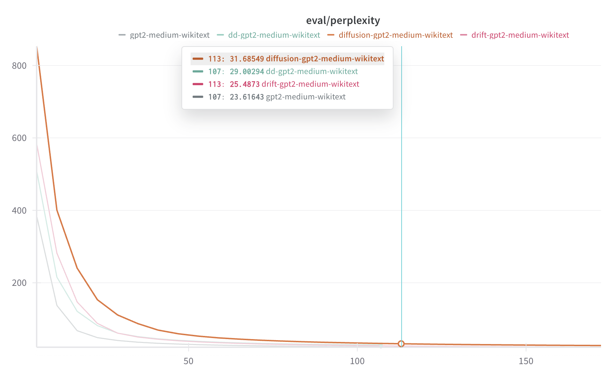

# Drift-Diffusion GPT-2 Model

## Introduction

The Drift-Diffusion GPT-2 (DD-GPT2) model introduces physical principles from particle dynamics into language modeling. By incorporating drift (directional bias) and diffusion (stochastic noise) into the attention mechanism, this model aims to enhance how information flows through the network.

## Core Concepts

### Drift Mechanism
- Adds learnable directional bias to attention weights
- Helps model focus on specific information patterns
- Implemented per attention head for fine-grained control

### Diffusion Mechanism
- Introduces controlled stochastic noise
- Encourages exploration of different attention patterns
- Helps prevent overfitting to specific patterns

## Model Architecture

### Base Architecture
- Built on GPT-2 Medium
- Modified attention mechanism
- Support for selective feature activation

### Key Components
1. **Attention Layer with Drift**:
   ```python
   def apply_drift(self, attn_output):
       drift_effect = self.drift_param * attn_output
       return attn_output + drift_effect
   ```

2. **Attention Layer with Diffusion**:
   ```python
   def apply_diffusion(self, attn_output):
       noise = torch.randn_like(attn_output) * self.diffusion_std
       return attn_output + noise
   ```

## Implementation Variants

We implemented three variants to study the effects of each mechanism:

### 1. Drift-Only Model
**Purpose**: Study directional bias in attention
```json
{
    "model_type": "dd-gpt2",
    "apply_drift": true,
    "apply_diffusion": false,
    "baseline_each_head": true
}
```
- **Hub Model**: BluebrainAI/drift-gpt2-medium-wikitext
- **Key Feature**: Learnable drift parameters per attention head

### 2. Diffusion-Only Model
**Purpose**: Evaluate stochastic exploration
```json
{
    "model_type": "dd-gpt2",
    "apply_drift": false,
    "apply_diffusion": true,
    "baseline_each_head": true
}
```
- **Hub Model**: BluebrainAI/diffusion-gpt2-medium-wikitext
- **Key Feature**: Controlled noise injection in attention

### 3. Combined Model
**Purpose**: Test synergistic effects
```json
{
    "model_type": "dd-gpt2",
    "apply_drift": true,
    "apply_diffusion": true,
    "baseline_each_head": true
}
```
- **Hub Model**: BluebrainAI/dd-gpt2-medium-wikitext
- **Key Feature**: Full drift-diffusion dynamics

## Training Details

### Dataset
- **Name**: WikiText-103-raw-v1
- **Type**: Large-scale language modeling corpus
- **Source**: Hugging Face datasets

### Training Configuration
```json
{
    "batch_size": 40000,
    "learning_rate": 1e-4,
    "bf16": true,
    "block_size": 1024,
    "num_train_epochs": 5,
    "warmup_ratio": 0.1,
    "weight_decay": 0.01
}
```

### Hardware Setup
- **Device**: Auto-distributed across available GPUs
- **Mixed Precision**: BF16 for efficient training
- **Memory Optimization**: Gradient checkpointing available

## Experimental Results

### Performance Comparison

#### Accuracy Comparison


#### Perplexity Comparison


### Key Observations
- Comparison between GPT-2 Medium baseline and three DD variants
- Training metrics tracked through Weights & Biases
- Performance measured on WikiText-103 dataset

## Usage Guide

- **Drift Component**: Adds directional bias to attention weights
- **Diffusion Component**: Introduces stochastic noise to attention outputs
- **Per-Head Processing**: Can apply drift and diffusion independently to each attention head
- **Configurable Application**: Can enable/disable drift and diffusion separately

## Architecture Details

### Drift Mechanism

```python
def apply_drift(self, attn_output):
    """
    Applies a learnable drift parameter to the attention output.
    The drift acts as a directional bias in the information flow.
    """
    if self.config.apply_drift:
        drift_effect = self.drift_param * attn_output
        return attn_output + drift_effect
    return attn_output
```

### Diffusion Mechanism

```python
def apply_diffusion(self, attn_output):
    """
    Applies stochastic noise (diffusion) to the attention output.
    This helps in exploring different attention patterns during training.
    """
    if self.config.apply_diffusion:
        noise = torch.randn_like(attn_output) * self.diffusion_std
        return attn_output + noise
    return attn_output
```

### Modified Attention Layer (GPT2AttentionWithDD)

The model introduces a specialized attention layer that incorporates both drift and diffusion:

```python
class GPT2AttentionWithDD(GPT2Attention):
    def __init__(self, config, is_cross_attention=False, layer_idx=None):
        super().__init__(config, is_cross_attention, layer_idx)
        if config.apply_drift:
            self.drift_param = nn.Parameter(torch.randn(
                config.n_head, 1, 1
            ) * 0.02)
        if config.apply_diffusion:
            self.diffusion_std = config.diffusion_std

    def forward(self, hidden_states, ...):
        # Standard attention computation
        attn_output = self.gpt_forward_without_cproj(...)
        
        # Apply drift and diffusion
        if self.config.apply_drift:
            attn_output = self.apply_drift(attn_output)
        if self.config.apply_diffusion:
            attn_output = self.apply_diffusion(attn_output)
            
        return self.c_proj(attn_output)
```

## Configuration

```python
from src.models.modeling_dd_gpt2 import DDGPT2Config

config = DDGPT2Config(
    vocab_size=50257,
    n_positions=1024,
    n_embd=768,
    n_layer=12,
    n_head=12,
    # DD-specific parameters
    apply_drift=True,
    apply_diffusion=True,
    diffusion_std=0.1,
    baseline_each_head=True  # Apply DD to each attention head independently
)
```

## Usage Example

```python
from src.models.modeling_dd_gpt2 import DDGPT2LMHeadModel
import torch

# Initialize model with drift and diffusion
config = DDGPT2Config.from_pretrained("gpt2-medium")
config.apply_drift = True
config.apply_diffusion = True
config.baseline_each_head = True

model = DDGPT2LMHeadModel(config)

# Forward pass
input_ids = torch.randint(0, 50257, (1, 128))
outputs = model(input_ids)
```

## Performance Characteristics

1. **Advantages**:
   - Improved handling of long-range dependencies through drift mechanism
   - Better exploration of attention patterns via diffusion
   - Flexible per-head application of drift and diffusion
   - Can be selectively enabled/disabled during training

2. **Training Considerations**:
   - Drift parameters are learned during training
   - Diffusion strength can be controlled via `diffusion_std`
   - May require careful tuning of drift and diffusion parameters
   - Can be applied independently to each attention head

3. **Memory and Computation**:
   - Small overhead from additional drift parameters
   - Minimal computational cost for diffusion noise generation
   - No significant increase in model size

4. **Use Cases**:
   - Tasks requiring better long-range dependency modeling
   - Applications needing controlled stochasticity
   - Scenarios where standard attention patterns may be insufficient

## Implementation Notes

1. **Drift Implementation**:
   ```python
   # Drift is implemented as a learnable parameter per attention head
   self.drift_param = nn.Parameter(torch.randn(config.n_head, 1, 1) * 0.02)
   ```

2. **Diffusion Control**:
   ```python
   # Diffusion strength is controlled by a configuration parameter
   noise = torch.randn_like(attn_output) * self.diffusion_std
   ```

3. **Integration with Base Model**:
   - Extends standard GPT2Attention class
   - Maintains compatibility with existing GPT-2 features
   - Can be used as a drop-in replacement for standard attention

4. **Configuration Options**:
   ```python
   config.apply_drift = True       # Enable drift mechanism
   config.apply_diffusion = True   # Enable diffusion mechanism
   config.baseline_each_head = True  # Apply to each head independently
   config.diffusion_std = 0.1     # Control diffusion strength
   ```
