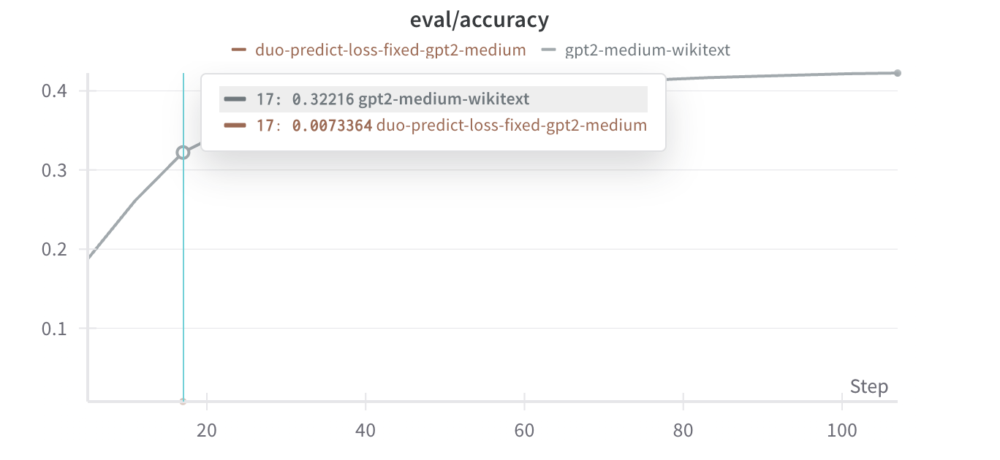
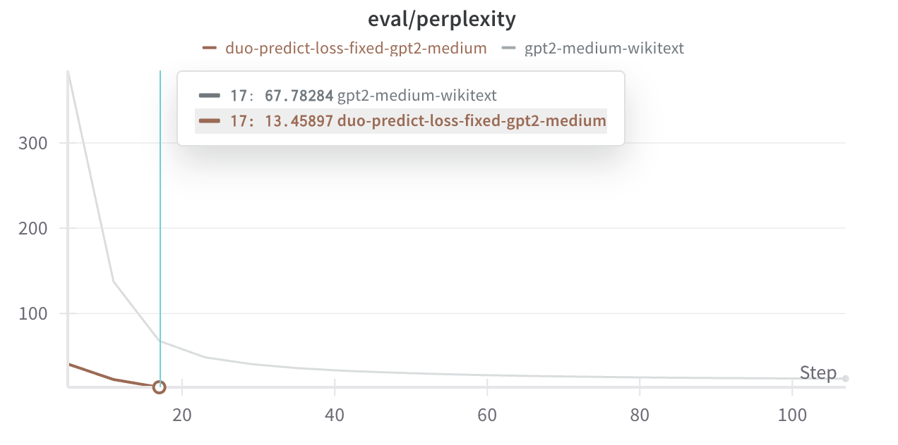

# Duo-Predict GPT-2 Model

## Introduction

The Duo-Predict GPT-2 model introduces a novel attention mechanism that alternates between different attention patterns for odd and even positions. This design enables the model to learn richer contextual relationships and potentially improve prediction quality.

## Core Concepts

### Alternating Attention Pattern
- Odd positions: Can attend to previous odd positions
- Even positions: Can attend to previous odd positions up to (i-2) and adjacent positions (i, i+1)
- Custom attention mask matrix for implementing this pattern

### Key Features
- Built on GPT-2 Medium architecture
- Custom attention mechanism
- Modified loss computation for dual predictions
- Efficient implementation using cached attention patterns

## Model Architecture

### Attention Mask Generation
```python
@lru_cache
def create_attention_mask_matrix(tn):
    matrix = torch.zeros(tn, tn)
    odd_cols = torch.arange(tn) % 2 == 1
    odd_rows = torch.tensor([x for x in range(1, tn) if x%2==1])
    even_rows = torch.tensor([x for x in range(1, tn) if x%2==0])
    
    # Odd rows: attend to previous odd positions
    tril_matrix = torch.tril(torch.ones(tn, tn))
    matrix[odd_rows, :] = tril_matrix[odd_rows, :] * odd_cols
    
    # Even rows: attend to odd j ≤ i-2, plus i and i+1
    tril_minus2 = torch.tril(torch.ones(tn, tn), diagonal=-2)
    matrix[even_rows, :] = tril_minus2[even_rows, :] * odd_cols
    matrix[even_rows, even_rows] = 1      # Current position
    matrix[even_rows, even_rows + 1] = 1  # Next position
    
    return matrix[1:, 1:].bool()
```

### Attention Implementation
```python
class DuoPredictGPT2Attention(nn.Module):
    def __init__(self, config, is_cross_attention=False, layer_idx=None):
        super().__init__()
        self.embed_dim = config.hidden_size
        self.num_heads = config.num_attention_heads
        self.head_dim = self.embed_dim // self.num_heads
        self.split_size = self.embed_dim
        
        # Attention projections
        self.c_attn = Conv1D(3 * self.embed_dim, self.embed_dim)
        self.c_proj = Conv1D(self.embed_dim, self.embed_dim)
        
        # Dropouts
        self.attn_dropout = nn.Dropout(config.attn_pdrop)
        self.resid_dropout = nn.Dropout(config.resid_pdrop)
```

## Implementation Variants

We implemented two variants to study different aspects of the model:

### 1. Standard Duo-Predict
**Purpose**: Evaluate basic alternating attention pattern
```json
{
    "model_type": "duo-predict-gpt2",
    "max_seq_length": 512,
    "block_size": 512
}
```
- **Hub Model**: BluebrainAI/duo-predict-gpt2-medium-wikitext
- **Key Feature**: Basic alternating attention implementation

### 2. Loss-Fixed Variant
**Purpose**: Improved loss computation for dual predictions
```json
{
    "model_type": "duo-predict-gpt2",
    "run_name": "duo-predict-loss-fixed-gpt2-medium"
}
```
- **Hub Model**: BluebrainAI/duo-predict-loss-fixed-gpt2-medium-wikitext
- **Key Feature**: Modified loss computation for better training

## Training Details

### Dataset
- **Name**: WikiText-103-raw-v1
- **Type**: Large-scale language modeling corpus
- **Source**: Hugging Face datasets

### Training Configuration
```json
{
    "batch_size": 40000,
    "per_device_train_batch_size": 64,
    "learning_rate": 1e-4,
    "num_train_epochs": 5,
    "warmup_ratio": 0.1,
    "weight_decay": 0.01,
    "max_seq_length": 512
}
```

### Hardware Setup
- **Device**: Auto-distributed across available GPUs
- **Mixed Precision**: BF16 for efficient training
- **Memory Optimization**: Gradient checkpointing available

## Experimental Results

### Performance Comparison

#### Accuracy Comparison


#### Perplexity Comparison


### Key Observations
1. **Attention Pattern Impact**:
   - Alternating attention provides unique context modeling
   - Different patterns for odd and even positions show complementary benefits

2. **Training Characteristics**:
   - Stable training with modified loss computation
   - Effective gradient flow through attention patterns
   - Competitive performance with baseline GPT-2

3. **Resource Efficiency**:
   - Cached attention patterns reduce computation
   - Efficient memory usage through smart implementation
   - Scalable to longer sequences

## Usage Guide

### Basic Usage
```python
from transformers import AutoConfig, AutoModel

# Initialize model
config = AutoConfig.from_pretrained("gpt2-medium")
config.model_type = "duo-predict-gpt2"
model = AutoModel.from_pretrained("BluebrainAI/duo-predict-gpt2-medium-wikitext")

# For loss-fixed variant
model = AutoModel.from_pretrained("BluebrainAI/duo-predict-loss-fixed-gpt2-medium-wikitext")
```

### Custom Attention Pattern
```python
# Create custom attention mask
attention_mask = create_attention_mask_matrix(sequence_length)

# Forward pass with custom mask
outputs = model(input_ids, attention_mask=attention_mask)
```

## Overview

The Duo-Predict GPT-2 model implements a novel attention mechanism designed for improved prediction capabilities. It modifies the standard GPT-2 architecture by introducing a specialized attention pattern that allows for more flexible information flow.

## Key Features

- **Custom Attention Matrix**: Implements a specialized attention pattern using `create_attention_mask_matrix`
- **Alternating Attention**:
  - Odd rows: Can attend to odd columns j ≤ i
  - Even rows: Can attend to odd j ≤ i-2, plus j=i and j=i+1
- **Enhanced SDPA**: Custom scaled dot-product attention implementation
- **Modified Loss Function**: Handles different sequence lengths between input and labels

## Attention Pattern Details

```
For sequence length n:
- Odd positions (i): 
  - Attend to odd positions j ≤ i
  - Creates a sparse attention pattern
- Even positions (i): 
  - Attend to odd positions j ≤ i-2
  - Attend to position i
  - Attend to position i+1
  - Enables local and distant connections
```

## Implementation Details

### Custom Attention Matrix Creation

```python
@lru_cache
def create_attention_mask_matrix(tn):
    # Initialize matrix
    matrix = torch.zeros(tn, tn)
    
    # Define masks for odd/even positions
    odd_cols = torch.arange(tn) % 2 == 1
    odd_rows = torch.tensor([x for x in range(1, tn) if x%2==1])
    even_rows = torch.tensor([x for x in range(1, tn) if x%2==0])
    
    # Set attention patterns
    tril_matrix = torch.tril(torch.ones(tn, tn))
    matrix[odd_rows, :] = tril_matrix[odd_rows, :] * odd_cols
    
    # Special pattern for even positions
    tril_minus2 = torch.tril(torch.ones(tn, tn), diagonal=-2)
    matrix[even_rows, :] = tril_minus2[even_rows, :] * odd_cols
    matrix[even_rows, even_rows] = 1
    matrix[even_rows, even_rows + 1] = 1
    
    return matrix[1:, 1:].bool()
```

### Custom Scaled Dot-Product Attention

```python
def scaled_dot_product_attention(query, key, value, attn_mask=None, 
                               dropout_p=0.0, is_causal=False, 
                               scale=None):
    L, S = query.size(-2), key.size(-2)
    scale_factor = 1 / math.sqrt(query.size(-1)) if scale is None else scale
    
    # Compute attention scores
    attn_weight = query @ key.transpose(-2, -1) * scale_factor
    
    # Apply custom attention mask
    if attn_mask is not None:
        attn_bias = torch.zeros(L, S, dtype=query.dtype, 
                              device=query.device)
        attn_bias.masked_fill_(attn_mask.logical_not(), float("-inf"))
        attn_weight += attn_bias
    
    # Apply softmax and dropout
    attn_weight = torch.softmax(attn_weight, dim=-1)
    attn_weight = torch.dropout(attn_weight, dropout_p, train=True)
    
    return attn_weight @ value
```

## Modified Loss Function

```python
def forward(self, input_ids, labels=None, **kwargs):
    # Get model outputs
    outputs = self.transformer(input_ids, **kwargs)
    hidden_states = outputs[0]
    lm_logits = self.lm_head(hidden_states)
    
    loss = None
    if labels is not None:
        bs, seq = lm_logits.shape[:2]
        if seq > labels.shape[1]:
            # Handle different sequence lengths
            total_labels = torch.full((bs, seq-1), -100, 
                                   dtype=input_ids.dtype, 
                                   device=input_ids.device)
            total_labels[:, :-1:2] = labels[:, 1:]
            total_labels[:, 1::2] = labels[:, :-1]
        else:
            total_labels = labels[:, 1:]
            
        # Compute loss
        loss = self.loss_function(
            lm_logits[:, :-1],
            total_labels,
            vocab_size=self.config.vocab_size
        )
```

## Configuration

```python
from src.models.modeling_duo_predict_gpt2 import DuoPredictGPT2Config

config = DuoPredictGPT2Config(
    vocab_size=50257,
    n_positions=1024,
    n_embd=768,
    n_layer=12,
    n_head=12,
    activation_function="gelu"
)
```

## Usage Example

```python
from src.models.modeling_duo_predict_gpt2 import DuoPredictGPT2LMHeadModel
import torch

# Initialize model
model = DuoPredictGPT2LMHeadModel(config)

# Prepare input
input_ids = torch.randint(0, 50257, (1, 100))
labels = torch.randint(0, 50257, (1, 50))  # Different sequence length

# Forward pass with labels
outputs = model(input_ids, labels=labels)
loss = outputs.loss
logits = outputs.logits
```

## Performance Characteristics

1. **Attention Efficiency**:
   - Sparse attention patterns reduce computation
   - Alternating attention mechanism balances local and global information

2. **Memory Usage**:
   - Similar to base GPT-2
   - Additional memory for attention mask caching

3. **Training Advantages**:
   - Flexible sequence length handling
   - Improved prediction capabilities through specialized attention

4. **Use Cases**:
   - Tasks requiring alternating prediction patterns
   - Scenarios with varying input/output lengths
   - Applications needing controlled information flow
