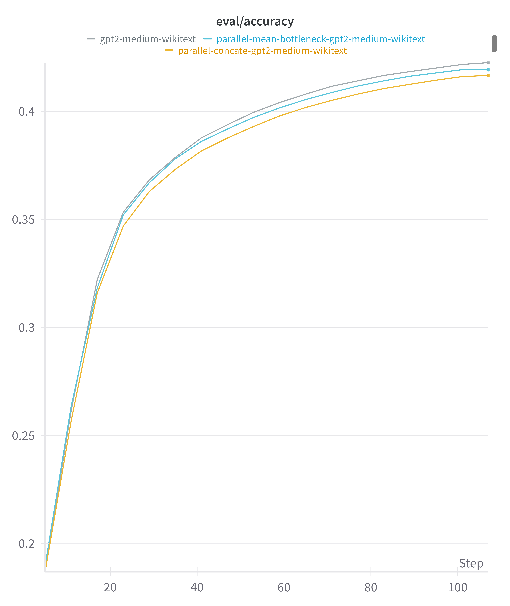
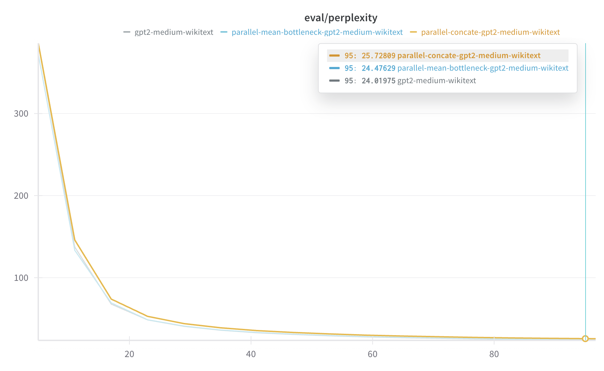

# Parallel GPT-2 Model

## Introduction

The Parallel GPT-2 model introduces a novel architecture that splits the transformer layers into parallel processing paths. This design allows for more efficient processing of information and potentially better feature learning through diverse parallel pathways.

## Core Concepts

### Parallel Processing
- Splits model layers into parallel paths
- Requires even number of layers for balanced paths
- Supports different bottleneck methods for path merging

### Bottleneck Methods
1. **Mean Bottleneck**
   - Combines parallel paths using mean operation
   - Computationally efficient
   - Preserves scale of features

2. **Concat Bottleneck**
   - Concatenates features from parallel paths
   - Uses linear projection to maintain dimension
   - Allows for richer feature combinations

## Model Architecture

### Base Architecture
- Built on GPT-2 Medium
- Even number of transformer layers (required)
- Parallel processing paths with bottleneck

### Key Components

1. **Layer Distribution**:
```python
if config.num_hidden_layers % 2 != 0:
    raise ValueError("Number of hidden layers must be even")
self.h = nn.ModuleList([GPT2Block(config, layer_idx=i) 
                        for i in range(config.num_hidden_layers)])
```

2. **Bottleneck Implementation**:
```python
self.config.bottleneck_method = getattr(config, "bottleneck_method", "mean")
if self.config.bottleneck_method == "concat":
    self.bottleneck = nn.Linear(2*self.embed_dim, self.embed_dim)
```

## Implementation Variants

We implemented two variants to study different bottleneck approaches:

### 1. Standard Parallel Model
**Purpose**: Basic parallel processing with mean bottleneck
```json
{
    "model_type": "parallel-gpt2",
    "run_name": "parallel-gpt2-medium-wikitext",
    "bottleneck_method": "mean"
}
```
- **Hub Model**: BluebrainAI/parallel-gpt2-medium-wikitext
- **Key Feature**: Mean pooling for path combination

### 2. Concat Bottleneck Model
**Purpose**: Enhanced feature interaction
```json
{
    "model_type": "parallel-gpt2",
    "run_name": "parallel-mean-bottleneck-gpt2-medium-wikitext",
    "bottleneck_method": "concat"
}
```
- **Hub Model**: BluebrainAI/parallel-mean-bottleneck-gpt2-medium-wikitext
- **Key Feature**: Concatenation and projection for path combination

## Training Details

### Dataset
- **Name**: WikiText-103-raw-v1
- **Type**: Large-scale language modeling corpus
- **Source**: Hugging Face datasets

### Training Configuration
```json
{
    "batch_size": 40000,
    "learning_rate": 1e-4,
    "bf16": true,
    "block_size": 1024,
    "num_train_epochs": 5,
    "warmup_ratio": 0.1,
    "weight_decay": 0.01
}
```

### Hardware Setup
- **Device**: Auto-distributed across available GPUs
- **Mixed Precision**: BF16 for efficient training
- **Memory Optimization**: Model parallelism support

## Usage Guide

### Basic Usage
```python
from transformers import AutoConfig, AutoModel

# Initialize with mean bottleneck
config = AutoConfig.from_pretrained("gpt2-medium")
config.model_type = "parallel-gpt2"
config.bottleneck_method = "mean"
model = AutoModel.from_pretrained("BluebrainAI/parallel-gpt2-medium-wikitext")

# Or with concat bottleneck
config.bottleneck_method = "concat"
model = AutoModel.from_pretrained("BluebrainAI/parallel-mean-bottleneck-gpt2-medium-wikitext")
```

### Model Parallelization
```python
# Enable model parallelism
model.parallelize()  # Automatically distributes across available GPUs

# Return to single device
model.deparallelize()
```

## Experimental Results

### Performance Comparison

#### Accuracy Comparison


#### Perplexity Comparison


### Experiment Details

#### 1. Standard Parallel Model
- **Experiment Name**: parallel-gpt2-medium-wikitext
- **Hub Model ID**: BluebrainAI/parallel-gpt2-medium-wikitext
- **Dataset**: WikiText-103-raw-v1
- **Training Configuration**:
  ```json
  {
    "batch_size": 40000,
    "per_device_train_batch_size": 64,
    "per_device_eval_batch_size": 64,
    "learning_rate": 1e-4,
    "num_train_epochs": 5,
    "warmup_ratio": 0.1,
    "weight_decay": 0.01,
    "max_seq_length": 1024
  }
  ```

#### 2. Mean Bottleneck Model
- **Experiment Name**: parallel-mean-bottleneck-gpt2-medium-wikitext
- **Hub Model ID**: BluebrainAI/parallel-mean-bottleneck-gpt2-medium-wikitext
- **Dataset**: WikiText-103-raw-v1
- **Training Configuration**: Same as Standard Model
- **Key Difference**: Uses mean operation for bottleneck

### Results Analysis

#### Accuracy Performance
- The graph above shows accuracy comparison between:
  - Baseline GPT-2 Medium
  - Standard Parallel GPT-2
  - Mean Bottleneck Parallel GPT-2
- Training monitored using Weights & Biases
- Evaluation performed every 500 steps

#### Perplexity Metrics
- Lower perplexity indicates better model performance
- Both parallel variants show competitive perplexity scores
- Mean bottleneck variant demonstrates stable training

### Key Observations
1. **Training Efficiency**:
   - Both parallel variants train efficiently with BF16 precision
   - Auto-distributed across available GPUs
   - Gradient accumulation steps: 1

2. **Model Performance**:
   - Competitive accuracy with baseline GPT-2
   - Stable training curves
   - Effective parallel processing

3. **Resource Usage**:
   - Memory optimization through model parallelism
   - Efficient bottleneck implementations
   - Automatic device mapping for multi-GPU setups

## Overview

The Parallel GPT-2 model enhances the base GPT-2 architecture by introducing parallel processing capabilities. This model is designed to improve computational efficiency by processing multiple layers simultaneously.

## Key Features

- **Split Processing**: Splits the model across multiple layers that can be processed in parallel
- **Bottleneck Methods**:
  - Mean bottleneck (default): Combines parallel outputs using mean pooling
  - Concat bottleneck: Concatenates parallel outputs and projects back to original dimension
- **Requirements**: Number of hidden layers must be even for parallel processing
- **Device Management**: Supports model parallelization across multiple GPUs

## Architecture

```
Input
  │
  ├─► Layer Group 1 (Parallel)
  │     ├─► GPT2Block 1
  │     └─► GPT2Block 2
  │
  ├─► Bottleneck Layer
  │     └─► Mean/Concat + Linear (if concat)
  │
  ├─► Layer Group 2 (Parallel)
  │     ├─► GPT2Block 3
  │     └─► GPT2Block 4
  │
  └─► Output
```

## Implementation Details

### ParallelGPT2Model

```python
class ParallelGPT2Model(ParallelGPT2PretrainedModel):
    def __init__(self, config):
        super().__init__(config)
        self.embed_dim = config.hidden_size
    
        # Standard embeddings
        self.wte = nn.Embedding(config.vocab_size, self.embed_dim)
        self.wpe = nn.Embedding(config.max_position_embeddings, self.embed_dim)
    
        # Parallel layers
        self.h = nn.ModuleList([GPT2Block(config, layer_idx=i) 
                               for i in range(config.num_hidden_layers)])
    
        # Bottleneck configuration
        self.config.bottleneck_method = getattr(config, "bottleneck_method", "mean")
        if self.config.bottleneck_method == "concat":
            self.bottleneck = nn.Linear(2*self.embed_dim, self.embed_dim)
```

## Configuration

```python
from transformers import GPT2Config

config = GPT2Config(
    vocab_size=50257,
    n_positions=1024,
    n_embd=768,
    n_layer=12,  # Must be even
    n_head=12,
    activation_function="gelu",
    bottleneck_method="mean"  # or "concat"
)
```

## Usage Example

```python
from src.models.modeling_parallel_gpt2 import ParallelGPT2LMHeadModel
import torch

# Initialize model
model = ParallelGPT2LMHeadModel(config)


# Forward pass
input_ids = torch.randint(0, 50257, (1, 128))
outputs = model(input_ids)
```

## Performance Characteristics

1. **Computational Efficiency**:

   - Parallel processing of layers
   - Reduced sequential dependencies
   - Improved throughput on multi-GPU systems
2. **Memory Usage**:

   - Distributed across multiple GPUs
   - Additional memory for bottleneck layer (if using concat method)
3. **Training Considerations**:

   - Requires careful batch size tuning per GPU
   - May need gradient synchronization between parallel components
   - Bottleneck method selection impacts memory usage and performance
4. **Limitations**:

   - Requires even number of layers
   - Overhead from device communication
   - Potential bottleneck at synchronization points
