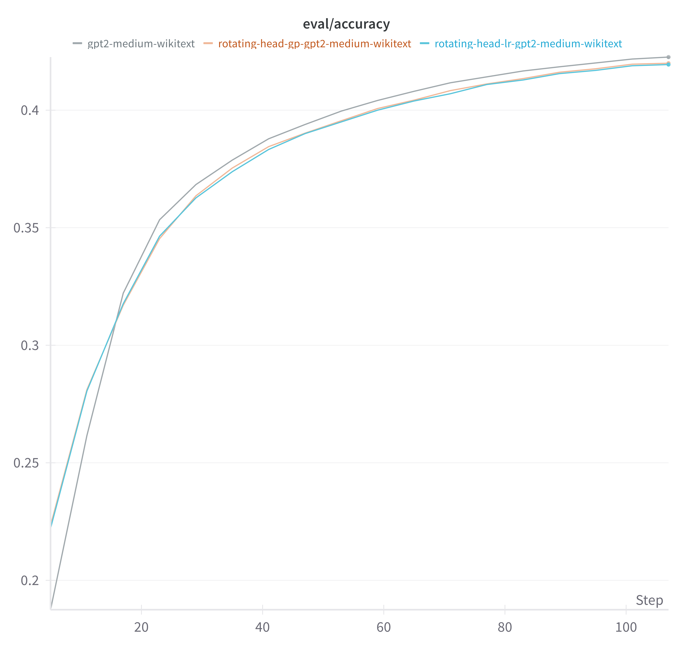
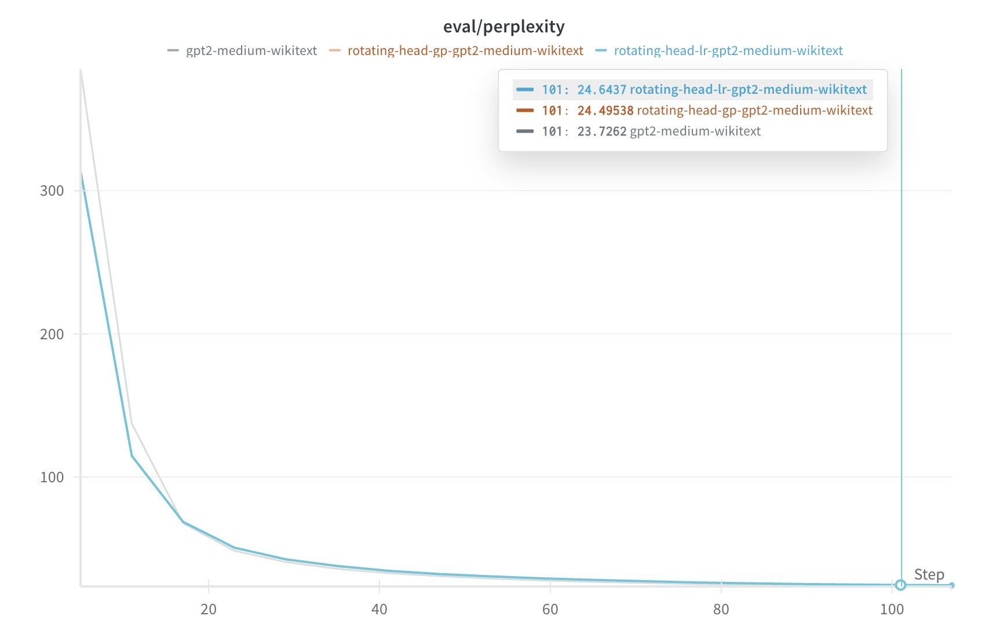

# Rotating Head GPT-2 Model

## Introduction

The Rotating Head GPT-2 model introduces a novel attention mechanism that uses head-specific rotary positional embeddings (RoPE). This design allows each attention head to learn unique positional relationships, enhancing the model's ability to capture diverse patterns in the input sequence.

## Core Concepts

### Head-Specific Rotary Embeddings
- Each attention head has its own set of rotary embeddings
- Two variants implemented:
  1. Learnable Rotations (LR)
  2. Geometric Progression (GP)
- Enhanced position-aware attention computation

### Key Features
- Built on GPT-2 Medium architecture
- Custom rotary position encoding
- Head-specific parameter learning
- Layer normalization options

## Model Architecture

### 1. Learnable Rotations (LR)
```python
class HeadSpecificLRRoPE(nn.Module):
    def __init__(self, num_heads, head_dim):
        super().__init__()
        self.num_heads = num_heads
        self.head_dim = head_dim
        
        # Initialize head-specific frequencies (learnable)
        self.frequencies = nn.Parameter(torch.randn(num_heads, head_dim // 2))
        self.layer_norm = nn.LayerNorm(head_dim // 2)
```

### 2. Geometric Progression (GP)
```python
class HeadSpecificGPRoPE(nn.Module):
    def __init__(self, num_heads, head_dim, base_frequency=10000):
        super().__init__()
        self.num_heads = num_heads
        self.head_dim = head_dim
        
        # Geometric frequency progression (fixed)
        scales = torch.exp(torch.linspace(0, 1, num_heads))  # [num_heads]
        frequency_base = 1.0 / (base_frequency ** (torch.arange(0, head_dim, 2) / head_dim))
        self.frequencies = (scales @ frequency_base.unsqueeze(0))  # [num_heads, dim//2]
```

## Implementation Variants

We implemented four variants to study different aspects of the model:

### 1. LR (Learnable Rotations)
**Purpose**: Learn optimal rotations per head
```json
{
    "model_type": "rotating-head-gpt2",
    "rotatinghead": "lr"
}
```
- **Hub Model**: BluebrainAI/rotating-head-lr-gpt2-medium-wikitext
- **Key Feature**: Learnable frequency parameters

### 2. LR with Layer Norm
**Purpose**: Stabilize learning of rotations
```json
{
    "model_type": "rotating-head-gpt2",
    "rotatinghead": "lr",
    "use_norm": true
}
```
- **Hub Model**: BluebrainAI/rotating-head-lr-norm-gpt2-medium-wikitext
- **Key Feature**: Added layer normalization

### 3. GP (Geometric Progression)
**Purpose**: Fixed geometric pattern of rotations
```json
{
    "model_type": "rotating-head-gpt2",
    "rotatinghead": "gp"
}
```
- **Hub Model**: BluebrainAI/rotating-head-gp-gpt2-medium-wikitext
- **Key Feature**: Fixed geometric progression of frequencies

### 4. GP with Layer Norm
**Purpose**: Normalize geometric pattern features
```json
{
    "model_type": "rotating-head-gpt2",
    "rotatinghead": "gp",
    "use_norm": true
}
```
- **Hub Model**: BluebrainAI/rotating-head-gp-norm-gpt2-medium-wikitext
- **Key Feature**: Normalized geometric features

## Training Details

### Dataset
- **Name**: WikiText-103-raw-v1
- **Type**: Large-scale language modeling corpus
- **Source**: Hugging Face datasets

### Training Configuration
```json
{
    "batch_size": 40000,
    "per_device_train_batch_size": 64,
    "learning_rate": 1e-4,
    "num_train_epochs": 5,
    "warmup_ratio": 0.1,
    "weight_decay": 0.01,
    "max_seq_length": 1024
}
```

### Hardware Setup
- **Device**: Auto-distributed across available GPUs
- **Mixed Precision**: BF16 for efficient training
- **Memory Optimization**: Gradient checkpointing available

## Experimental Results

### Performance Comparison

#### Accuracy Comparison


#### Perplexity Comparison


### Key Observations
1. **Rotation Pattern Impact**:
   - Learnable rotations show adaptive pattern learning
   - Geometric progression provides stable baselines
   - Layer normalization improves training stability

2. **Training Characteristics**:
   - LR variants require more training steps
   - GP variants converge faster
   - Layer norm helps both variants

3. **Resource Efficiency**:
   - Minimal additional parameters
   - Efficient computation through caching
   - Scalable to longer sequences

## Usage Guide

### Basic Usage
```python
from transformers import AutoConfig, AutoModel

# Initialize model with LR
config = AutoConfig.from_pretrained("gpt2-medium")
config.model_type = "rotating-head-gpt2"
config.rotatinghead = "lr"  # or "gp" for geometric progression
model = AutoModel.from_pretrained("BluebrainAI/rotating-head-lr-gpt2-medium-wikitext")

# For GP variant
model = AutoModel.from_pretrained("BluebrainAI/rotating-head-gp-gpt2-medium-wikitext")
```

### Custom Configuration
```python
# With layer normalization
config.use_norm = True
model = RotatingHeadGPT2Model(config)

# Adjust base frequency (GP only)
config.rotatinghead = "gp"
config.base_frequency = 5000  # default is 10000
model = RotatingHeadGPT2Model(config)
```
